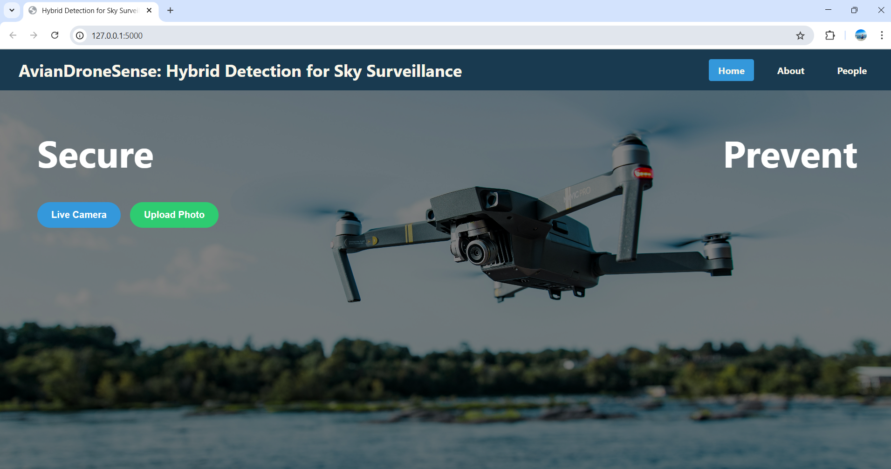
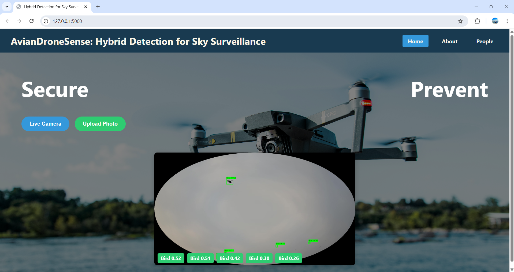
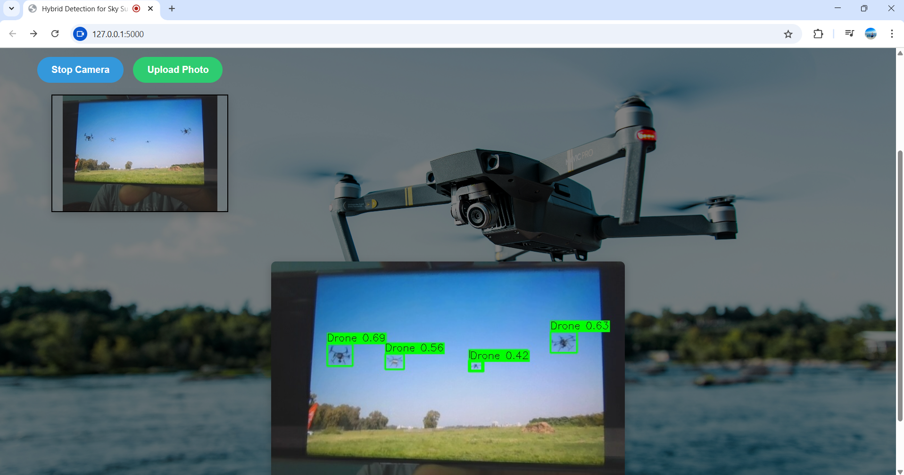

# 🛸 AvianDroneSense-Hybrid-Detection-for-Sky-Surveillance

## 🔍 Overview

The **Drone vs Bird Detection System** is an intelligent real-time object detection tool that uses a YOLOv8 deep learning model to accurately distinguish between drones and birds from images, videos, and live camera feeds.

Built using the **Ultralytics YOLOv8** framework and integrated with a **Flask** web interface, the system can detect drones with high precision and perform automated actions like:
- Real-Time Detection: Identifies and locates drones and birds instantly.
- User-Friendly: Easy to use with camera-based detection or image/video uploads.
- Weather Resistance: Reliable operation in various outdoor conditions.
- Custom Alerts: Sounding an alarm if a drone is detected for more than 4 seconds.
- High Accuracy: Reliable performance across various environments.

This system is especially useful in **surveillance**, **aviation**, and **defense** sectors where distinguishing drones from birds is crucial.

---

## 📸 Project Preview

### 🖼️ Image Upload Interface

### 🎥 Real-Time Detection Interface

### 📦 Drone Detection Example

---

## 🚀 Features

- Real-time detection using webcam
- Upload image or video for detection
- 4-second drone presence timer with alarm
- Clean, responsive Flask-based UI
- Model trained using custom YOLOv8
- The dataset has been anotated using roboflow.
---

## 🧠 Model

- **Framework**: [Ultralytics YOLOv8](https://github.com/ultralytics/ultralytics)
- **Dataset**: Custom dataset (Birds and Drones), YOLO format
- **Classes**: `0: Bird`, `1: Drone`
- **Image size**: 640x640
- **Format**: `.pt` model weights

---

